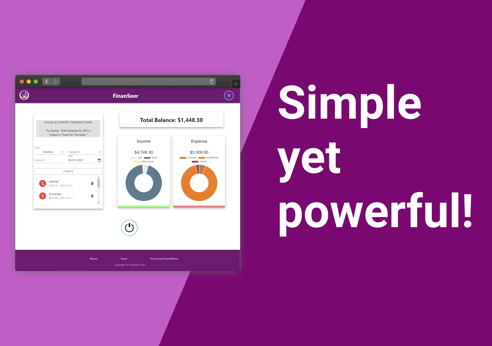

# 
 

## 👁‍🗨 Overview 👁‍🗨
### What?

Finanseer is a simple yet powerful tool for tracking your personal financial transactions.  WIth an intuitive user interface, minimal sign up steps, we make it easy to get started and begin tracking your money.

### Who?

Finanseer was created by a team of individuals that are passionate about technology & personal finance.  Our goal is to make managing your money easy and fun!  

### Why?

Personal finance education is very important but not something that’s not covered in the core education curriculum.  There is also a stigma associated with talking about money, which we want to eradicate.  

### Why Now?

With all the turbulence in the economy, there has never been a better time to take control of your personal finance.

### How?

The idea and the initial phases of this application were done in a Hackathon!  The group came together quickly, hashed out the idea and the initial scope and implemented initial functionality within 48 hours! 

 

## 🖥 Installation 🖥

### Running locally
1. Install Node v16
2. Install yarn (`npm install -g yarn`)
3. Run `yarn bootstrap`
4. Run `yarn start`

### To deploy to heroku
1. Contact [Spencer Carver](https://github.com/spencer-carver) to get added to finanseer heroku app
2. Install the heroku cli
3. Authenticate to your account
4. Add the remote repository `heroku`
5. On the latest `master` branch you want to deploy from, run `yarn deploy:heroku`
6. View the deployed web app at https://finanseer.herokuapp.com
7. View the app logs at https://dashboard.heroku.com/apps/finanseer/logs

## 🛠 Built With 🛠 

| 
|  |  |  |  |  |  |

## 👤👤 Team 👤👤

| Ayman Omer                                                                                                                                                                  | Angel B. Fernandez                                                                                                                                                        | Spencer Carver                                                                                                                                                     | Dan Tracy                                                                                                                                                   | Kartik Nath                                                                                                                                                             |
| --------------------------------------------------------------------------------------------------------------------------------------------------------------------------- | ------------------------------------------------------------------------------------------------------------------------------------------------------------------------- | ------------------------------------------------------------------------------------------------------------------------------------------------------------------ | ----------------------------------------------------------------------------------------------------------------------------------------------------------- | ----------------------------------------------------------------------------------------------------------------------------------------------------------------------- |
|   |   |   |   |   |
|                                                                                                                                                                             |                                                                                                                                                                           |                                                                                                                                                                    |                                                                                                                                                             |                                                                                                                                                                         |